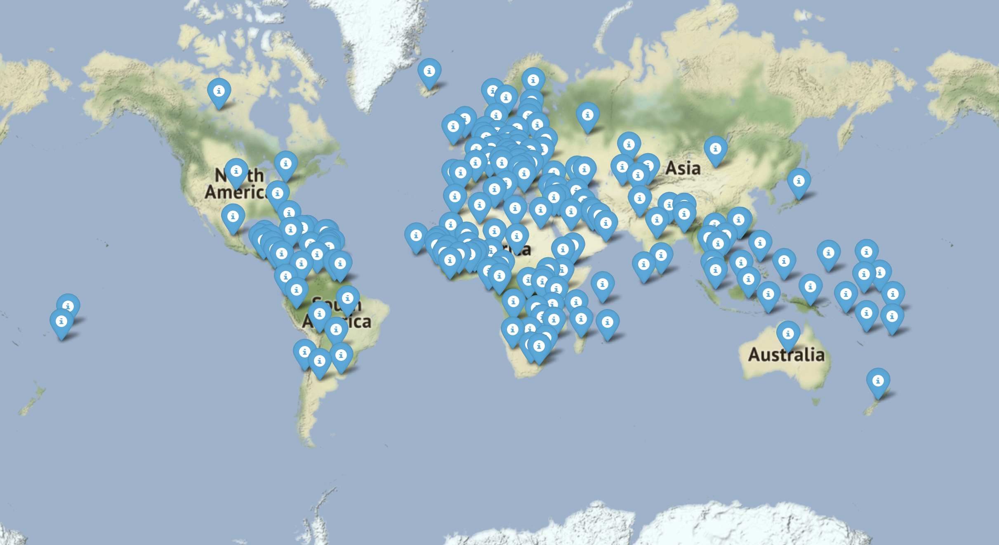

# Spotify

This module creates a web with a map and get an information about artist

## Installation

Use the package manager [pip](https://pip.pypa.io/en/stable/) to install base64,flask,requests,geopy.geocoders,folium,pycountry.

```bash
pip install base64,flask,requests,geopy.geocoders,folium,pycountry
```
## Usage

```python
import base64
from flask import Flask,render_template, request
import requests
from geopy.geocoders import Nominatim
import folium
import pycountry
```


